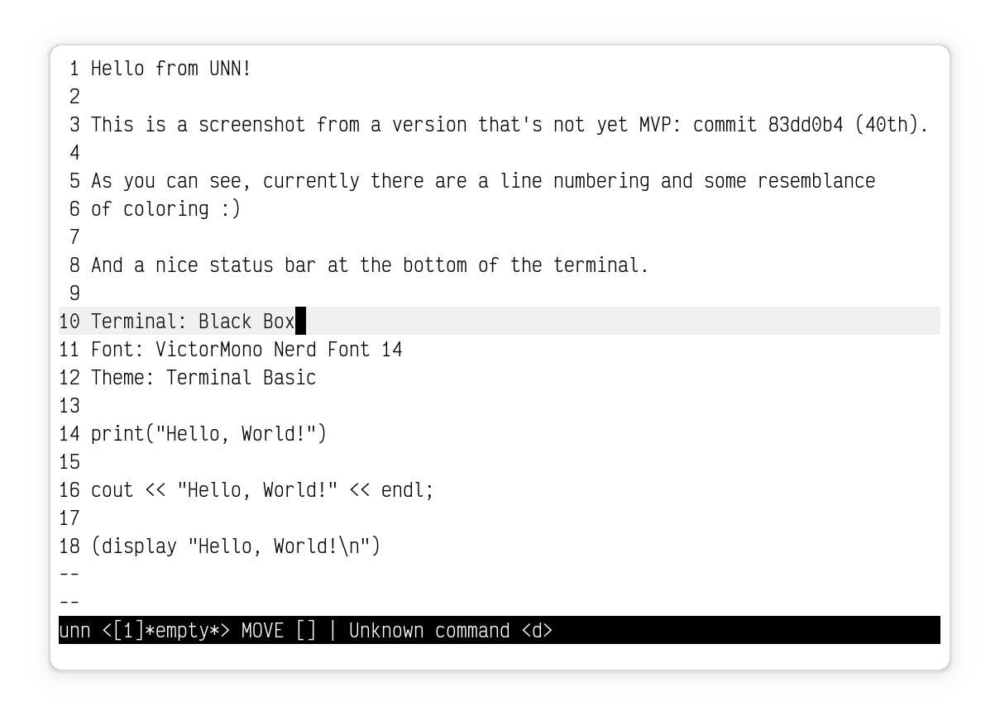

# UNN's Not Named

**The project's currently not even in the MVP (Minimum Viable Product) stage, WIP.**

**However, I always make sure that it compiles without any errors or warnings before committing. Most likely, it will run well enough to check the current pre-MVP implementation.**

## Description

**UNN** is a text editor with high ambitions and far-fetched goals. 

It speaks with **Lisp** (or will so in the future).

## Details

Depends on the awesome [notcurses](https://github.com/dankamongmen/notcurses) library and several **POSIX** headers.

Licensed entirely under the **GPL-3.0** license.

**UNN** stands both for *Unnamed's Not Named* and *UNN's Not Named* simultaneously! You can also refer to it as *Unnamed*, *Unn*, *UNN*, *Not Named*, *noname*, etc.

## Initial Guide

For those eager ones willing to try out a raw pre-MVP **UNN** (don't get your hopes too up!), here are some tips:

* 99% of the binds are specified in the **binds.h** header
* **UNN** uses **S, M, W, K** binds for left, down, up, right cursor movement accordingly (for instance, **Vi** and it's descendants use **H, J, K, L**)
* There are two modes: **Move** and **Edit**. The first one is used for the general movement (in-text; switching window, buffer), control (toggle flags, quit, etc.). The second one is, obviously, used for editing a buffer's contents, and mostly consists of 1-to-1 mappings of keys to according character input into a buffer
* In the **Move** mode, pressing several keys in a row is called a **key sequence** or a **combination**. Several binds beginning with the same from one to several keys are grouped into **continuations**. Looking into the **binds.h** header helps a lot
* In the **Edit** mode, pressing two keys simultaneously is handled differently, making it a **sim key sequence** binding call. For example, any two-key combination of the cursor movement keys will switch current mode from **Edit** back to **Move** (SK, WK, SM, ...)
* Windows and buffers in **UNN** are similar to those in **Emacs**

  
Some useful bindings

  **cfo** (control, file, open) - open a prompt for the user to input a new file 's path to be open, create a new buffer linked to the file, and switch current window's buffer to it

  **cfss** (control, file, save, current) - save current buffer's contents to it's linked file path

  **cfso** (control, file, save, other) - open a prompt for the user to input a new path to be set for the current window's buffer, then save the buffer like the **cfss** bind does

  **ctm** (control, toggle, markers) - toggle line continuation markers, that are placed at the right border of a window to mark long lines (so long that don't fit the current window)

  **ctn** (control, toggle, line numbers) - toggle line numbers located at the left border of a window that... number lines!

  **f** (forward) - move cursor to the first character of the next space-delimited word

  **b** (backward) - move cursor to the last character of the previous space-delimited word

## FAQs

  
Another text editor? Lame.

    I know, really. For me, above all, UNN is a pet-project and a hobby.

  
Why did you name your project this way?

    For you to ask, and yes, I'm serious. Well, you can also interpret the naming as the representation of UNN's infinite capabilities - there are so much of them and there is so much to possibly add, that you simply can't express it with words, you just <b>can't name it</b>.

  
What was UNN inspired by and why?

    Good question! First and the most influential of them all is <b>Emacs</b>, because of it's overall complexity and the fact that it <i>speaks with Lisp</i>. I love the idea of a jack-of-all-trades editor. But I'm not really a fan of Emacs Lisp and would've been a lot more amazed by Emacs if it was fully written in Lisp. I was also inspired by <b>Vim</b> because it basically represents an entire domain-specific language for text/code editing, your editing speeds up enormously when you finally acquire at least intermediate proficiency with it! But, as silly as it sounds, I want my text editor be more than a text editing utility. Otherwise, why would it <i>speak with Lisp</i>? Infinite extensibility on top! My love for <b>CLI</b>, <b>TUI</b> and the general terminal workflow also played an important role in the decision of implementing my own <b>unnamed</b> text editor.

  
Why is UNN currently implemented entirely/mostly in C?

    It's planned to be this way. What I want to do is to firstly make a bit "crappy" (because of my first-time experience) version of UNN in an environment that I'm already familiar with, to, you know, bootstrap the workflow. This first version will be the UNN's <b>MVP</b> (Minimum Viable Project). From the moment I have implemented the MVP, I'll be writing code almost exclusively in and with it. The reason I haven't begun doing everything in Scheme Lisp is because I'm not so proficient in it (newbie), and I'll gain the proficiency gradually by extending and rewriting parts of the editor in Scheme. I love <b>C</b> because of it's simplicity, "low-levelness". And it's great that the most Scheme implementations provide a C interoperability. Also, it's a language that I already know really well.

  
If you're not proficient with Scheme, then why not master it at first?

    Because I'm truly eager to implement UNN!

